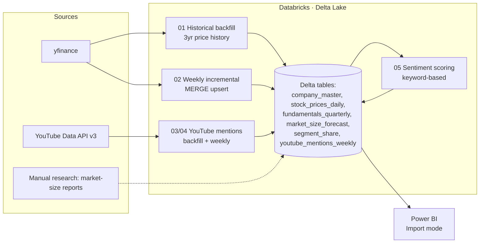

# PORTFOLIO_SHOWCASE
# Quantum Computing Sector — Investment Research Dashboard

**A self-directed data engineering + BI project**: an end-to-end pipeline that
tracks 12 quantum-computing-related public companies across stock price,
fundamentals, market-size forecasts, and social/media sentiment — built on
Databricks (Delta Lake) and visualized in Power BI.

> 📄 This file is a 2-minute overview. For setup instructions and technical
> detail, see [`README_Databricks.md`](./README_Databricks.md) and
> [`README_PowerBI.md`](./README_PowerBI.md).

---

## The problem this solves

Quantum computing is a fast-moving, highly speculative sector — pure-play
stocks (IonQ, Rigetti, D-Wave, Quantum Computing Inc.) trade at extreme
valuation multiples, while diversified players (IBM, Google, Microsoft,
NVIDIA) treat quantum as one bet among many. There was no single place to
see stock performance, fundamentals, analyst market-size forecasts, and
public sentiment side by side — so I built one.

## What it does

| Capability | Source | Refresh |
|---|---|---|
| Daily stock price history (3 years) | yfinance | Weekly (automated) |
| Quarterly revenue, fiscal-year-aligned across companies with different fiscal calendars (e.g. Microsoft/June, NVIDIA/January) | yfinance | Weekly (automated) |
| Market-size forecasts from 5 independent research firms | Manual research, cited sources | Static, periodically reviewed |
| YouTube mention volume, by company, language, and channel country | YouTube Data API v3 | Weekly (automated) |
| Keyword-based sentiment classification on video titles (positive / negative / mixed) with the exact triggering keywords surfaced | Custom multilingual keyword model | Weekly (automated) |
| Interactive Power BI dashboard | Databricks SQL Warehouse → Power BI | Weekly (Import mode) |

## Screenshots

*(Add exported PNGs from Power BI here — see "Adding your own screenshots" below)*

## Architecture

Six Delta tables, refreshed on a weekly Databricks Job schedule, feeding a
Power BI report connected via a cloud-native SQL Warehouse connection (no
on-premises gateway required).

## Skills demonstrated

**Data engineering**
- Idempotent, re-runnable pipelines using Delta Lake `MERGE INTO` (safe to
  re-run without creating duplicates or losing manually-corrected data)
- Schema evolution handling (`overwriteSchema`, `ALTER TABLE ADD COLUMNS`)
- API quota-aware design (batching, rate-limit-friendly sleep intervals)
- Secrets management via Databricks Secrets (no credentials in code)
- Defensive data cleaning (handling malformed/invisible characters from
  copy-pasted API keys, positional-vs-named schema mismatches)

**Analytics engineering**
- Fiscal-year alignment logic for cross-company comparison (companies with
  Dec/June/January fiscal year-ends made comparable on one time axis)
- DAX measures for dynamic ranking (`TOPN`), and YoY-style variance
  calculations
- Multilingual, explainable sentiment classification (keyword-based,
  not a black box — every score is traceable to specific matched terms)

**BI & visualization**
- Power BI data modeling (star-schema-style relationships, custom date
  tables)
- Cloud-to-cloud BI architecture (Databricks SQL Warehouse → Power BI,
  no gateway)

**Python / tooling**
- `yfinance`, `google-api-python-client`, `langdetect`, `pandas`, PySpark
- Databricks CLI / Secrets, Databricks Jobs scheduling

## Known limitations (documented, not hidden)

- Quarterly fundamentals are limited to ~4-5 quarters of history (yfinance
  free-tier constraint)
- No historical market-cap tracking (deliberately excluded rather than
  shipping an inaccurate approximation)
- Sentiment scoring is a lightweight keyword model, not a trained NLP
  classifier — chosen for transparency and zero cost, with limitations
  documented in `README_Databricks.md`

## Adding your own screenshots

1. In Power BI, open the report → **File → Export → Export to PDF**, or use
   **File → Export → Export this page as image** for individual pages
2. Save PNGs into a `screenshots/` folder next to this file
3. Update the image links above to match your filenames

## Links

- Full technical documentation: [`README_Databricks.md`](./README_Databricks.md), [`README_PowerBI.md`](./README_PowerBI.md)
- Source code: [`databricks/`](./databricks/), [`fetch_quantum_data.py`](./fetch_quantum_data.py)
